```mermaid
graph TB
    A[🧠 LLM<br/>The Brain]
    B[🔧 Tools<br/>The Hands]
    C[📚 Knowledge<br/>The Memory]
    
    A -->|Controls| B
    A -->|Queries| C
    B -->|Results| A
    C -->|Context| A
    
    style C fill:#FFD700
```

# Building AI Agents with MCP and N8N

**Jonas Schmitt, AI Architect at SI EA R&D**

---
layout: two-cols-header
---

## The Paradigm Shift in AI/ML
### From Custom Models to Foundation Models

```mermaid
graph LR
    subgraph Old["⏳ Traditional ML"]
        A1[🔬 Train Custom<br/>Models]
        A2[📊 Collect & Label<br/>Massive Datasets]
        A3[⏱️ Months of<br/>Development]
    end
    
    subgraph New["⚡ Foundation Models"]
        B1[🔌 Integrate<br/>via API]
        B2[✍️ Prompt<br/>Engineering]
        B3[⚡ Fast Deployment]
    end
    
    Old ==>|"The Paradigm Shift"| New
    
    style Old fill:#ffe6e6,stroke:#cc0000,stroke-width:2px
    style New fill:#e6ffe6,stroke:#00cc00,stroke-width:2px
```

> 💡 **The change**: From training models to integrating them
::left::

**Focus shifts to:**
- **Integration** - Connect via APIs
- **Prompting** - Guide behavior with text
- **Guardrails** - Add safety rules & filters

::right::

**AI Engineering ≠ ML Engineering**

Building **agents**, instead of models

Agents = LLM + Tools + Knowledge

---
layout: two-cols-header
---

## Building AI Systems
### Agent = LLM + Tools + Knowledge

::left::

| Component | Difficulty | Our Solution |
|-----------|------------|----------|
| 🧠 **LLM** | ✅ Easy | GPT-5, Claude |
| 🔧 **Tools** | 🟡 Moderate | **MCP Server Builder** ⭐ |
| 📚 **Knowledge** | 🔴 Complex | **Smart Help** ⭐ |

> We tackle the **two main challenges**: Tool integration & EA domain knowledge

::right::

---
layout: two-cols-header
---

## MCP Server Builder
### Automated Tool Generation from OpenAPI

> **Generate once, deploy everywhere: Transform REST APIs into MCP-compliant tools**

```mermaid {scale: 0.4}
graph LR
    subgraph Input["📄 Input"]
        O[OpenAPI<br/>Specs]
    end
    
    subgraph Builder["🔧 Builder Pipeline"]
        P[📄 Parse<br/>Spec]
        G[🔨 Generate<br/>Client]
        T[🔗 Synthesize<br/>Tools]
        B[📦 Package<br/>Builder]
    end
    
    subgraph Output["📦 Packages"]
        PY[🐍 Python<br/>Wheels]
        NU[📘 NuGet<br/>Packages]
    end
    
    subgraph Apps["🤖 Applications"]
        A1[🤖 AI Agents]
        A2[🖥️ Custom<br/>Apps]
    end
    
    O --> P
    P --> G
    G --> T
    T --> B
    B --> PY
    B --> NU
    PY --> A1
    PY --> A2
    NU --> A1
    NU --> A2
    
    style Input fill:#e1f5fe,stroke:#01579b,stroke-width:2px
    style Builder fill:#fff3e0,stroke:#e65100,stroke-width:2px
    style Output fill:#ffe0b2,stroke:#e65100,stroke-width:2px
    style Apps fill:#f3e5f5,stroke:#4a148c,stroke-width:2px
```

::left::

**Builder Pipeline:**

1. **Parse Spec** - Extract operations & schemas from OpenAPI
2. **Generate Client** - Create typed API client libraries
3. **Generate Tools** - MCP tool wrappers for each operation
4. **Package** - Build distributable packages

**Output:** Ready-to-use MCP server packages

::right::

**Deployment & Integration:**
- **Multi-Target** - Python wheels & NuGet packages
- **AI Agents** - Direct integration via MCP protocol  
- **Custom Apps** - Embed as libraries in applications
- **Type-Safe** - Generated Pydantic models with validation

---
layout: two-cols-header
---

## Smart Help Vision
### Automated Knowledge Base Building for EA

> **Build once, use many times: Transform documentation into an AI-ready knowledge base**

```mermaid {scale: 0.4}
graph LR
    subgraph Sources["📚 Core Sources"]
        S1[COSIMA<br/>Docs]
        S2[P/I<br/>Knowledge Graph]
        S3[Additional<br/>Data & Ontologies]
    end
    
    subgraph Pipeline["🔧 Reusable Pipeline"]
        P[📚 Pre-Process]
        I[🔄 Index]
        E[🔗 Enrich]
    end
    
    subgraph Artifacts["💾 Portable Artifacts"]
        A1[📦 Searchable<br/>Indices]
        A2[🔗 Knowledge<br/>Graph]
    end
    
    subgraph Deploy["🚀 Deploy"]
        D[Cloud or<br/>On-Premise]
    end
    
    subgraph Apps["🤖 Applications"]
        ECO[ECO]
        PAE[PA-SOL]
        ELX[ELX]
    end
    
    S1 --> P
    S2 --> P
    S3 --> P
    P --> I
    I --> E
    E --> A1
    E --> A2
    A1 --> D
    A2 --> D
    D --> ECO
    D --> PAE
    D --> ELX
    
    style Sources fill:#e1f5fe,stroke:#01579b,stroke-width:2px
    style Pipeline fill:#fff3e0,stroke:#e65100,stroke-width:2px
    style Artifacts fill:#ffe0b2,stroke:#e65100,stroke-width:2px
    style Deploy fill:#e8f5e9,stroke:#2e7d32,stroke-width:2px
    style Apps fill:#f3e5f5,stroke:#4a148c,stroke-dash:3
```

::left::

**Pipeline Architecture:**

1. **Pre-Process** - Discovery, conversion, validation
2. **Index** - Embedding generation, keyword extraction
3. **Enrich** - Ontology merging, relationship building

**Output:** Portable artifacts (indices + knowledge graph)

::right::

**Deployment & Applications:**
- **Cloud or On-Premise** - Infrastructure as Code (IaC)
- **Applications** - ECO, PA-SOL Copilot, ELX, Enabler
- **LLMOps** - Observability, evaluation, optimization
---
layout: two-cols-header
---

## PoC Scope & Demo
### What We're Building vs. What's Next

```mermaid {scale: 0.35}
graph LR
    subgraph Sources["📚 Data Sources"]
        S1[COSIMA<br/>Source Docs]
        S2[P/I Knowledge Graph]
    end
    
    subgraph Pipeline["Ingestion Pipeline"]
        subgraph PreProcess["Pre-Processing"]
            P1[Discovery]
            P2[Conversion]
            P3[Validation]
        end
        I1[Chunking]
        M[🤖 Embedding<br/>Model]
        I2[Indexing]
        I3[Serialization]
    end
    
    subgraph Artifacts["💾 Artifacts"]
        A1[Vector<br/>Index]
        A2[Keyword<br/>Index]
        A3[Metadata<br/>Index]
    end
    
    subgraph Demo["🎯 PoC Demo"]
        E[ECO Smart<br/>Help]
    end
    
    subgraph Future["❌ Post-PoC"]
        F1[Additional<br/>Data Sources]
        F2[Graph<br/>Enrichment]
        F3[Deployment]
    end
    
    S1 --> P1
    S2 --> P3
    P1 --> P2
    P2 --> P3
    P3 --> I1
    I1 --> I2
    M --> I2
    I2 --> I3
    I3 --> A1
    I3 --> A2
    I3 --> A3
    A1 --> E
    A2 --> E
    A3 --> E
    
    style Sources fill:#e1f5fe,stroke:#01579b,stroke-width:2px
    style M fill:#fff9c4,stroke:#f57f17,stroke-width:2px
    style PreProcess fill:#fff3e0,stroke:#e65100,stroke-width:2px
    style Pipeline fill:#fff3e0,stroke:#e65100,stroke-width:4px
    style Artifacts fill:#ffe0b2,stroke:#e65100,stroke-width:2px
    style Demo fill:#c8e6c9,stroke:#2e7d32,stroke-width:3px
    style Future fill:#f5f5f5,stroke:#9e9e9e,stroke-dash:3
```

::left::

**🎯 PoC Deliverables:**

1. **📚 Ingestion Pipeline Library** - Modular, reusable components for document processing
2. **💾 Portable Artifacts** - Vector, keyword, and metadata indices ready for deployment
3. **🤖 ECO Smart Help Demo** - Working chatbot with P/I ontology filtering

::right::

**Architecture Decisions (ADRs):**
- **ADR-001:** Reusable pipeline library
- **ADR-002:** Pydantic data contracts
- **ADR-003:** PoC scope (COSIMA + P/I only)
- **ADR-004:** OpenTelemetry observability
- **ADR-005:** File-based artifacts
- **ADR-006:** Embedding + metadata filtering

---